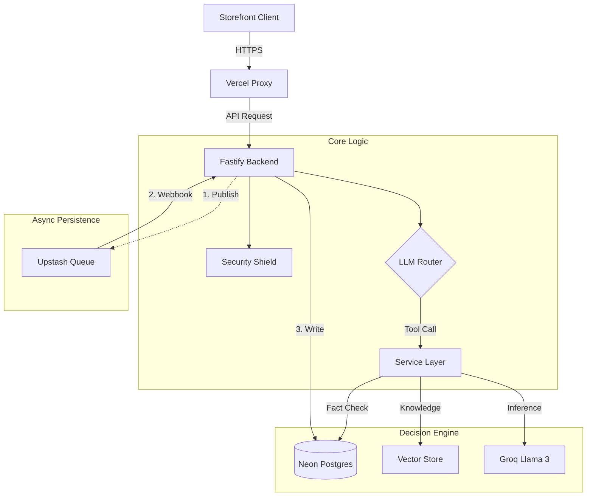

# Archive 99: AI-Powered Vintage Fashion Support 🧥✨

> **"The Future of Vintage E-Commerce is Conversational."**

**Archive 99** is a specialized e-commerce platform designed to eliminate the high friction of buying vintage clothing online. Traditional search bars fail when every item is unique ("One-of-One"). We replace them with **Aria**, an AI Senior Archivist who serves as a proactive sales associate.

She doesn't just "search keywords"; she understands:
*   **Fit Nuance**: "Does this 90s tee fit boxy?" (She knows measurements).
*   **Policy Rigidity**: "Can I return this?" (She enforces Final Sale rules via RAG).
*   **Inventory Truth**: "Do you have the Akira tee?" (She checks SQL, suppressing hallucinations).

     

---

## 🏗️ Architecture: The "Hybrid Brain"

Archive 99 uses a **Router-Based AI Architecture**. The Agent is not a black box; it is a switchboard that intelligently routes user intent between **Deterministic Tools** (SQL) and **Probabilistic Inference** (Vectors).



### Key Design Decisions
1.  **Split Stack**: We house the Backend on **Render** (Docker/Node) and Frontend on **Vercel** (Edge). This allows us to run `transformers.js` (local embeddings) on the backend without bloating the frontend bundle.
2.  **Async Persistence**: Chat history is written to DB *after* the response is sent. This keeps UI latency under 200ms.
3.  **Local Embeddings**: We run `all-MiniLM-L6-v2` inside the Node process. Meaning: **Zero API cost** for RAG vectorization.

---

## 🚀 Quick Start

### Prerequisites
*   **Node.js**: v20.10.0+ (Required for `transformers.js` WASM).
*   **pnpm**: v9.0+ (`npm i -g pnpm`).
*   **Database**: A Neon Postgres project with `pgvector` enabled.
*   **LLM**: A Groq Cloud API Key (Llama 3 70b).

### Installation

1.  **Clone the Repository**
    ```bash
    git clone https://github.com/aswinbala005/spur-archive-99.git
    cd spur-archive-99
    ```

2.  **Configure Environment**
    Create the backend `.env` file. You *must* fill in these values for the app to boot.
    ```bash
    cp apps/backend/.env.example apps/backend/.env
    # Edit .env with your keys
    ```
    *See [07-dev-guidelines.md](docs/07-dev-guidelines.md) for the detailed key guide.*

3.  **Automated Setup**
    This script installs dependencies, generates Drizzle artifacts, pushes the schema, and seeds mock inventory.
    ```bash
    ./setup.sh
    ```

4.  **Start Services (Monorepo)**
    This starts both the SvelteKit frontend (5173) and Fastify backend (3000) concurrently.
    ```bash
    pnpm dev
    ```

### Access Points
*   **Storefront**: `http://localhost:5173`
*   **Backend API**: `http://localhost:3000`
*   **Swagger/OpenAPI**: *Not enabled in prod, check generic `/health`*.

---

## 🛠️ Tech Stack & Capabilities

### Frontend Module (`apps/frontend`)
*   **Framework**: **SvelteKit** (Svelte 5 Runes).
    *   *Why?* The new Runes state system (`$state`) creates far simpler reactive logic for the Chat Widget than React's `useEffect`.
*   **Aesthetic**: **"Old Money"**.
    *   Custom Tailwind config (`serif` fonts, `stone-900` colors).
*   **UX**: **Optimistic UI**.
    *   Messages appear instantly. The UI handles the "Thinking" state gracefully.

### Backend Module (`apps/backend`)
*   **Runtime**: **Fastify v5**.
    *   *Why?* 4x throughput of Express. Native `JSON Schema` validation prevents invalid data from ever hitting our logic.
*   **Validation**: **Zod** + **TypeBox**.
    *   Strict runtime checking of all Inputs and Environment Variables.
*   **AI Orchestration**: **Vercel AI SDK Core**.
    *   Standardizes tool calling across LLM providers.

### Data Module
*   **Startups**: **Neon (Postgres)**.
    *   Serverless autoscaling.
*   **Vectors**: **pgvector**.
    *   Stored directly in the `documents` table. No external Vector DB required.
*   **Queue**: **Upstash QStash**.
    *   Handles asynchronous webhooks reliably.

---

## ✨ Key Features Breakdown

### 1. 🛍️ The "Smart" Storefront
*   **Real-time Stock**: Badge updates ("Low Stock", "Sold Out") reflect strict inventory counts.
*   **A/B/C Grading**: Products include deep metadata about condition (e.g. "Grade B: Slight fading on collar").
*   **Cart Persistence**: Basket state survives page reloads via LocalStorage sync.

### 2. 🤖 Aria (The Agent)
*   **Identity Guardrails**: Aria never breaks character. She refuses to answer political questions or "ignore previous instructions".
*   **Inventory Tool**: `checkStock({ query: "Stussy" })` runs a fuzzy SQL search.
*   **Policy Tool**: `getPolicy({ query: "Return" })` performs cosine similarity search on the Knowledge Base.

### 3. 🛡️ Enterprise Security
*   **Bot Shield**: **Arcjet** analyzes every request fingerprint. Scrapers are blocked with `403 Forbidden`.
*   **Rate Limiting**: **Redis** tracks IP usage. Limits aggressive users to 10 messages/minute.
*   **Secure Sessions**: `HttpOnly` Signed Cookies prevent XSS tokens theft.

---

## 🌳 Project Structure

```bash
spur-archive-99/
├── apps/
│   ├── backend/                 # Fastify API (The Decision Engine)
│   │   ├── src/
│   │   │   ├── config/          # Configuration & Environment
│   │   │   │   ├── arcjet.ts    # Bot Protection Middleware Rules
│   │   │   │   ├── README.md    # Documentation for Config
│   │   │   │   ├── cors.ts      # CORS Options (Frontend Origin)
│   │   │   │   └── env.ts       # Zod Schema for .env Validation
│   │   │   ├── db/              # Database Access Layer
│   │   │   │   ├── README.md        # Documentation for DB
│   │   │   │   ├── index.ts     # Drizzle + Neon Connection Factory
│   │   │   │   ├── migrate.ts   # Database Migration Runner
│   │   │   │   ├── schema.ts    # Database Tables (Products, Messages)
│   │   │   │   └── seed.ts      # Seeding Script (Mock Data)
│   │   │   ├── plugins/         # Fastify Plugin Registrations
│   │   │   │   ├── README.md    # Documentation for Plugins
│   │   │   │   └── sensible.ts  # Standard HTTP Error Helpers
│   │   │   ├── routes/          # HTTP Route Handlers
│   │   │   │   ├── chat.ts      # POST /chat (Main Agent Logic)
│   │   │   │   ├── health.ts    # GET /health (Uptime Check)
│   │   │   │   ├── hooks.ts     # POST /hooks (QStash Webhooks)
│   │   │   │   ├── products.ts  # GET /products (Inventory Feed)
│   │   │   │   └── README.md    # Documentation for Routes
│   │   │   ├── scripts/         # Local Maintenance Scripts
│   │   │   │   ├── reset.ts     # Nuclear Reset (Drop Tables)
│   │   │   │   └── README.md    # Documentation for Scripts
│   │   │   ├── services/        # Business Logic (Pure Functions)
│   │   │   │   ├── InventoryService.ts # Stock Logic & SQL Filtering
│   │   │   │   ├── LLMService.ts       # Vercel AI SDK Orchestration
│   │   │   │   ├── RAGService.ts       # Vector Search & Retrieval
│   │   │   │   └── README.md           # Documentation for Services
│   │   │   ├── app.ts           # Application Factory (Testing)
│   │   │   └── server.ts        # Main Entry Point (Production)
│   │   ├── .dockerignore        # Exclude node_modules from Build
│   │   ├── .env.example         # Template for Environment Vars
│   │   ├── README.md            # Backend Specific Readme
│   │   ├── Dockerfile           # Multi-stage Container Build
│   │   ├── drizzle.config.ts    # Drizzle Kit Configuration
│   │   ├── package.json         # Backend Dependencies
│   │   └── tsconfig.json        # Strict TypeScript Config
│   │
/   └── frontend/                # SvelteKit UI (The Storefront)
│       ├── src/
│       │   ├── lib/
│       │   │   ├── components/  # Reusable UI Atoms
│       │   │   │   ├── ui/      # ShadCN Primitives (Button, etc)
│       │   │   │   │   └── ...
│       │   │   │   └── README.md # Docs for Components
│       │   │   ├── widget/      # Chat Widget Feature
│       │   │   │   ├── ChatBubble.svelte # Single Message Bubble
│       │   │   │   ├── ChatInput.svelte  # Resizable Textarea
│       │   │   │   ├── ChatWindow.svelte # Main Chat Container
│       │   │   │   ├── ChatWidget.svelte # Floating Trigger Button
│       │   │   │   ├── icons.ts          # SVG Icons (Spinner, Arrow)
│       │   │   │   └── README.md         # Docs for Widget
│       │   │   ├── README.md    # Docs for Shared Lib
│       │   │   ├── types.ts     # Shared TS Interfaces
│       │   │   └── utils.ts     # CN (ClassNames) Helper
│       │   ├── routes/          # File-based Routing
│       │   │   ├── about/       # /about Page
│       │   │   │   └── +page.svelte
│       │   │   ├── products/    # /products Page
│       │   │   │   └── +page.svelte
│       │   │   ├── +error.svelte  # Global Error Boundary
│       │   │   ├── +layout.svelte # Main Navigation Wrapper
│       │   │   ├── +page.svelte   # Home Page (Landing)
│       │   │   └── README.md      # Docs for Routing
│       │   ├── app.css          # Global Tailwind Styles
│       │   ├── app.d.ts         # SvelteKit Type Defs
│       │   ├── app.html         # HTML Skeleton
│       ├── static/              # Static Assets
│       │   └── favicon.png
│       ├── .dockerignore        # Exclude files from Vercel Build
│       ├── .npmrc               # NPM Config
│       ├── README.md            # Frontend Specific Readme
│       ├── components.json      # ShadCN Config
│       ├── package.json         # Frontend Dependencies
│       ├── postcss.config.js    # PostCSS Config
│       ├── svelte.config.js     # SvelteKit Config
│       ├── tailwind.config.js   # Tailwind Theme Config
│       ├── tsconfig.json        # Frontend TypeScript Config
│       ├── vercel.json          # Vercel Proxy Rules
│       └── vite.config.ts       # Vite Build Config
│
├── docs/                        # God-Tier Documentation
│   ├── adr/                     # Architectural Decision Records
│   │   └── 001-why-fastify.md   # Decision: Fastify vs Express
│   ├── images/                  # Static Images for Docs
│   ├── 00-overview.md           # Project Whitepaper
│   ├── 01-design-system.md      # Aesthetic & UX Spec
│   ├── 02-system-architecture.md # Hybrid Brain Diagrams
│   ├── 03-backend-architecture.md # Backend Layer Deep Dive
│   ├── 04-database-schema.md    # ERD & SQL Strategy
│   ├── 05-ai-engine.md          # AI Persona & Tool Logic
│   ├── 06-api-specification.md  # API Contract & Errors
│   ├── 07-dev-guidelines.md     # Setup & Coding Standards
│   ├── 08-roadmap.md            # Future Feature Plans
│   ├── 09-testing.md            # QA & Evals Strategy
│   ├── 10-troubleshooting.md    # Operational Runbook
│   ├── 11-security.md           # Security & Threat Model
│   ├── 12-deployment.md         # Ops Manual (Render/Vercel)
│   └── 13-tradeoffs.md          # Analysis of Decisions
│
├── packages/                    # Monorepo Shared Tools
├── .dockerignore                # Global Docker Ignore
├── .gitignore                   # Global Git Ignore
├── docker-compose.yml           # Local Dev Infrastructure
├── package.json                 # Monorepo Workspace Config
├── pnpm-lock.yaml               # Dependency Lockfile
├── pnpm-workspace.yaml          # Workspace Definitions
├── README.md                    # This Dashboard
└── setup.sh                     # Automated Installer Script
```

---

## 📂 Documentation Map

We believe in **"Documentation as Code"**. Every layer is documented in detail.

| Doc | Audience | Description |
| :--- | :--- | :--- |
| [**00-Overview**](docs/00-overview.md) | Everyone | Whitepaper: Vision, mission, and high-level goals. |
| [**01-Design**](docs/01-design-system.md) | Designers | "Old Money" aesthetic specifications. |
| [**02-Architecture**](docs/02-system-architecture.md) | Architects | Deep dive into the Hybrid Brain diagrams. |
| [**03-Backend**](docs/03-backend-architecture.md) | Backend Devs | Service Layers, Logic, and Config. |
| [**04-Database**](docs/04-database-schema.md) | Data Engineers | ER Diagrams & `pgvector` strategy. |
| [**05-AI-Engine**](docs/05-ai-engine.md) | AI Engineers | Aria's Persona, System Prompt, and RAG. |
| [**06-API-Spec**](docs/06-api-specification.md) | Frontend Devs | Contract for `/chat`, `/hooks`. |
| [**07-Dev-Guide**](docs/07-dev-guidelines.md) | Contributors | File Structure, Standards, and Workflow. |
| [**08-Roadmap**](docs/08-roadmap.md) | Product Managers | Future enterprise features (Stripe, Voice). |
| [**09-Testing**](docs/09-testing.md) | QA / SDET | Testing Strategy (Deterministic vs Evals). |
| [**10-Ops-Manual**](docs/10-troubleshooting.md) | DevOps | Operational Runbook & Emergency Reset. |
| [**11-Security**](docs/11-security.md) | InfoSec | Threat Model, Arcjet, and Defense Layers. |
| [**12-Deployment**](docs/12-deployment.md) | DevOps | Render/Vercel Production Guide. |
| [**13-Tradeoffs**](docs/13-tradeoffs.md) | Architects | "Why Monolith?" & "Why Fastify?" Analysis. |

---

## 👩‍💻 Contributing

We welcome contributions from the community!
Please read our [Development Guidelines](docs/07-dev-guidelines.md) for Pull Request conventions and Coding Standards.

1.  **Fork** the repo.
2.  **Branch**: `git checkout -b feat/your-feature`.
3.  **Commit**: `git commit -m "feat: Add Voice Mode"`.
4.  **Push**: `git push origin feat/your-feature`.
5.  **PR**: Open a Pull Request on GitHub.

## 🤝 Connect and Collaboration

**Archive 99** is built by **Aswin Bala**.
If you are interested in collaborating, researching AI Agent patterns, or just want to chat about vintage fashion tech:

*   **Email**: `aswinbala316@gmail.com`
*   **LinkedIn**: [Aswin Bala](https://www.linkedin.com/in/aswin-bala-612b23240)
*   **GitHub**: [@aswinbala005](https://github.com/aswinbala005)

> "We are building the interface, not just the infrastructure."

---

## 📄 License

Distributed under the **MIT License**. This project is open-source and free to use.

## 🆘 Support

Encountered a bug or have a question?
*   Check the [Troubleshooting Guide](docs/10-troubleshooting.md) first.
*   Open a [GitHub Issue](https://github.com/aswinbala005/spur-archive-99/issues).
*   Reach out to the maintainers via Email.

## 🙏 Acknowledgments

*   **Vercel AI SDK**: For the unified interface that makes switching LLMs trivial.
*   **Neon**: For enabling a serverless database strategy that actually works.
*   **ShadCN**: For the accessible, high-quality component primitives.
*   **Groq**: For the insanely fast inference speeds (LPU).
