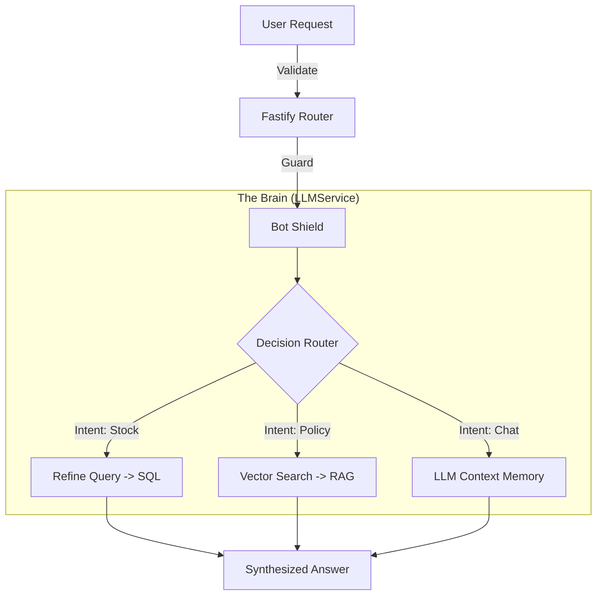

# Backend API (The Decision Engine)

**Role**: The "Brain" of the operation.
**Architecture**: Modular Monolith (stateless).
**Status**: Production Hardened.

---

## 🏗️ 1. Architecture: The "Hybrid Brain"

This is **not** a standard CRUD backend. It is an **Agentic Router**.
It does not just retrieve rows; it **decides** which data source to query based on user intent.



### Core Philosophy
*   **Deterministic Tools**: We use SQL for facts (Stock, Price). We never let the LLM guess numbers.
*   **Probabilistic Context**: We use Vectors for nuace (Style, Policy).

---

## 🛠️ 2. Tech Stack & Decisions

| Technology | Role | Why? |
| :--- | :--- | :--- |
| **Fastify v5** | Server Framework | 4x faster than Express. Native JSON Schema validation prevents invalid payloads from entering our Service Layer. |
| **Neon** | Database | Serverless Postgres. Scales to zero. Supports `pgvector` for "Hybrid Search" (SQL + Embeddings in one DB). |
| **Drizzle ORM** | Data Access | Zero-runtime overhead. Type-safe SQL builder. |
| **Vercel AI SDK** | LLM Orchestrator | Standardizes the "Tool Calling" loop across OpenAI, Groq, and Anthropic. |
| **Upstash QStash** | Async Queue | Handles "Fire and Forget" tasks (saving chat history) without slowing down the User Response. |

---

## 📂 3. Domain Layers (DDD)

We enforce a strict 3-Layer architecture to prevent "Spaghetti Code".

### Layer 1: Interface (`src/routes/`)
*   **Goal**: Validation & Traffic Control.
*   **Logic**:
    *   Checks `content-type: application/json`.
    *   Validates Body against Zod Schema (e.g. `message: z.string().max(500)`).
    *   Checks Auth (Signed Cookies).
*   **Output**: Clean, typed data passed to Service Layer.
*   **Docs**: [Standard Routes](./src/routes/routes.md)

### Layer 2: Service (`src/services/`)
*   **Goal**: Business Logic & Intelligence.
*   **Logic**:
    *   **LLMService**: The "Router". Holds the System Prompt and Tool Definitions.
    *   **InventoryService**: The "Tool". converting natural language "Baggy Jeans" into SQL `ILIKE` queries.
    *   **RAGService**: The "Librarian". Embeds user text and finds similar Policy chunks.
*   **Docs**: [Services Deep Dive](./src/services/services.md)

### Layer 3: Data (`src/db/`)
*   **Goal**: Persistence.
*   **Logic**:
    *   Raw Drizzle Queries.
    *   Schema Definitions (`schema.ts`).
    *   Seed Scripts.
*   **Docs**: [Database Schema](./src/db/db.md)

---

## ⚡ 4. Operational Commands

### Development
```bash
# Start the Hot-Reload server (Uses `tsx` for fast TypeScript execution)
pnpm dev

# Run full type check
pnpm check
```

### Database
```bash
# Push Schema edits to Neon (No migration files needed in Dev)
pnpm db:push

# Reset & Reseed Data (Nuclear option)
pnpm seed
```

### Production Build
```bash
# Compiler via tsc
pnpm build

# Start the compiled Node.js app
pnpm start
```

---

## �️ 5. Security & Reliability

1.  **Bot Protection**:
    *   Middleware: [Arcjet](./src/config/arcjet.ts).
    *   Logic: Blocks requests with `score < 95`.

2.  **Rate Limiting**:
    *   Engine: Redis.
    *   Limit: 10 requests / minute / IP.

3.  **Circuit Breaking**:
    *   If Groq API fails, we return a "High Load" fallback message instead of crashing.

---

## 🗺️ Documentation Map

| Readme | Description |
| :--- | :--- |
| **[routes.md](./src/routes/routes.md)** | Network Layer Specs. |
| **[services.md](./src/services/services.md)** | AI & Business Logic Specs. |
| **[db.md](./src/db/db.md)** | SQL Schema & Migrations. |
| **[config.md](./src/config/config.md)** | Environment & Middleware. |
| **[plugins.md](./src/plugins/plugins.md)** | Fastify Ecosystem. |
