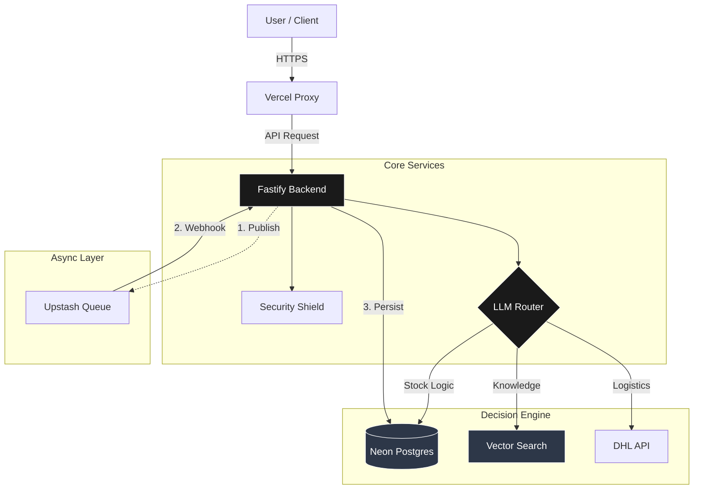
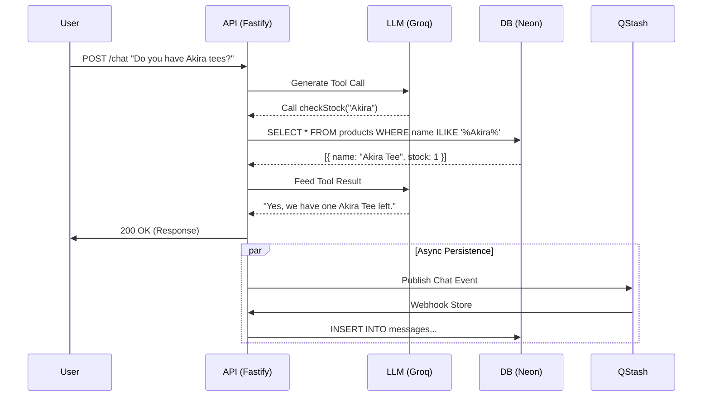
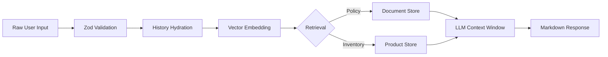
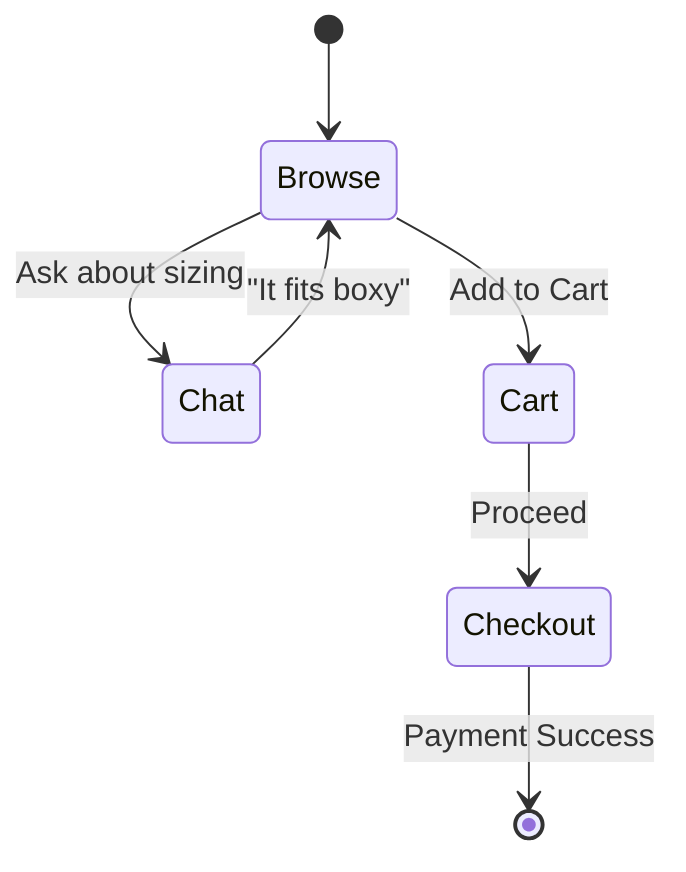

# 02. System Architecture

**Role**: The Blueprint of Archive 99.
**Pattern**: Monolithic, Stateless API with "Hybrid Brain" Router.
**Docs**: [Overview](./00-overview.md) | [Backend](./apps/backend/backend.md) | [Database](./04-database-schema.md)

---

## 🏗️ 1. High-Level Architecture

We process Requests, not just Data.
The core innovation is the **LLM Router**, which sits between the User and the Services.

### The "Need" for this Architecture
1.  **Hallucination Protection**: E-commerce requires 100% factual accuracy for stock. An LLM cannot be trusted to "guess" inventory. We *must* use deterministic SQL for that.
2.  **Latency vs. Reliability**: Users hate waiting. We split the architecture into **Sync** (Chat Response < 1s) and **Async** (History Storage > 100ms) paths using QStash.
3.  **Security**: Direct DB access is dangerous. We force all operations through a Service Layer (Sanitized Tools).

---

## 🔄 2. System Flow (The "Hybrid Brain" Request)

How a user message travels from "Input" to "Insight".

### Logic Breakdown
1.  **Ingest**: Application receives JSON payload. **Arcjet** validates IP and Rate Limit.
2.  **Reasoning**: **LLMService** sends history + prompt to Llama 3. The LLM decides *which tool* to use.
3.  **Execution**: The **Service Layer** executes the chosen tool (e.g., `InventoryService.checkStock`).
4.  **Synthesis**: The Tool Output (Raw JSON) is fed back to the LLM to generate a polite, "Senior Archivist" response.
5.  **Persistence**: The conversation is saved *after* the response is sent, via a background queue.

---

## 🔀 3. Data Flow & Transformation

How raw text becomes actionable data.

### The Tech Stack Strategy
-   **Neon (Postgres)**: Chosen for **Serverless Auto-scaling**. We don't pay for idle time.
-   **pgvector**: Storing embeddings *inside* the main DB simplifies atomic commits and backups. No need for a separate Pinecone instance.
-   **Local Embeddings**: We run `Transformers.js` inside the Node process. This saves ~$0.0001 per request and removes a network hop.

---

## 🛍️ 4. User Journey Flow

The expected happy path for a customer.

---

## 🧱 5. Domains & Layers

We separate concerns strictly. A Route never talks to the DB directly.

| Domain | directory | Responsibility | Docs |
| :--- | :--- | :--- | :--- |
| **Interface** | `src/routes` | HTTP, Zod Validation, Auth. | [routes.md](../apps/backend/src/routes/routes.md) |
| **Service** | `src/services` | Business Logic, AI Orchestration. | [services.md](../apps/backend/src/services/services.md) |
| **Data** | `src/db` | Schema, SQL Queries, Migrations. | [db.md](../apps/backend/src/db/db.md) |
| **Infrastructure** | `src/config` | Env Vars, Security, Queues. | [config.md](../apps/backend/src/config/config.md) |
