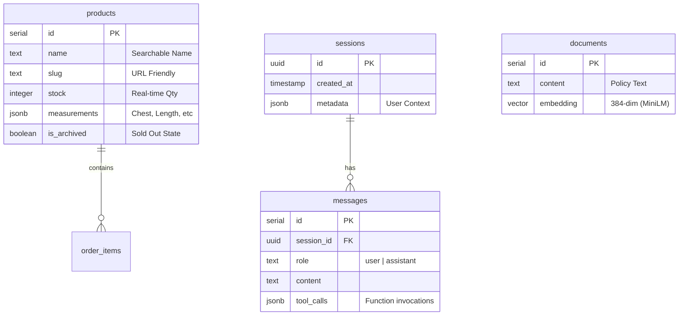

# 05. Database Schema & Data Strategy

**Role**: The "Long-Term Memory" and "Truth Source" for Archive 99.
**Tech**: Neon (Serverless Postgres), Drizzle ORM, pgvector.

## 1. The Strategy: Why this Stack?

| Problem | Solution | Tech |
| :--- | :--- | :--- |
| **Scale** | Drops cause traffic spikes (10k users in 1 min). | **Neon Serverless** (Autoscaling). |
| **Complexity** | Vintage items have unique attributes (era, condition). | **JSONB Columns** (Flexible metadata). |
| **Search** | "Returns policy" vs "I want a tee" requires different logic. | **Hybrid Search** (SQL `ILIKE` + `pgvector`). |
| **Speed** | Chat needs <200ms responses. | **Upstash Redis** (Caching) + **Drizzle** (Lightweight SQL). |

---

## 2. Domain Layers
*Review detailed code docs: [apps/backend/src/db/db.md](../apps/backend/src/db/db.md)*

The database logic is encapsulated in the **Data Domain**:
1.  **Schema Definition** (`schema.ts`): The contract.
2.  **Connection Factory** (`index.ts`): Manages pooling.
3.  **Seeding Scripts** (`seed.ts`): [scripts.md](../apps/backend/src/scripts/scripts.md).

---

## 3. Entity Relationship Diagram (ERD)



---

## 4. Key Tables & Logic

### A. `products` ( The Inventory)
-   **Need**: To track unique vintage items with widely varying attributes.
-   **Logic**:
    -   `stock`: Checked atomically before any "Add to Cart".
    -   `measurements` (JSONB): Allows us to store `{"chest": 22, "length": 28}` for tees and `{"waist": 32, "inseam": 30}` for denim without altering the schema.
    -   **Search**: We use `ILIKE` on the `name` column for the `checkStock` tool.

### B. `documents` (The Knowledge Base)
-   **Need**: To allow the AI to answer policy questions ("Return policy?", "Shipping times?").
-   **Logic**:
    -   `embedding`: A 384-dimensional vector generated by `transformers.js`.
    -   `content`: The human-readable chunk.
    -   **Search**: The `RAGService` uses Cosine Similarity (`<=>`) to find relevant chunks.

### C. `sessions` & `messages` (The Chat History)
-   **Need**: To maintain context across a conversation.
-   **Logic**:
    -   `session_id` is stored in a `Signed HttpOnly Cookie`.
    -   Messages are persisted *asynchronously* via **QStash** to ensure the user never waits for a DB write.

---

## 5. Workflows

### The "Hybrid Search" Workflow
1.  **User**: *"Do you have a large leather jacket?"*
2.  **LLM**: Routes to `InventoryService`.
3.  **SQL**: `SELECT * FROM products WHERE name ILIKE '%leather jacket%'`.
4.  **Filter**: Code filters the JSONB `measurements` to approximate "Large".
5.  **Result**: Returns valid options.

### The "Vector Retrieval" Workflow
1.  **User**: *"Do you ship to Japan?"*
2.  **LLM**: Routes to `RAGService`.
3.  **Vector**: `SELECT content FROM documents ORDER BY embedding <=> query_vector LIMIT 1`.
4.  **Result**: Returns the International Shipping Policy.

---

## 6. Commands
All database operations are managed via `pnpm` in the `apps/backend` folder.

```bash
# Push schema changes to Neon
pnpm db:push

# View data in GUI
pnpm db:studio

# Reset and Seed data
pnpm seed
```
